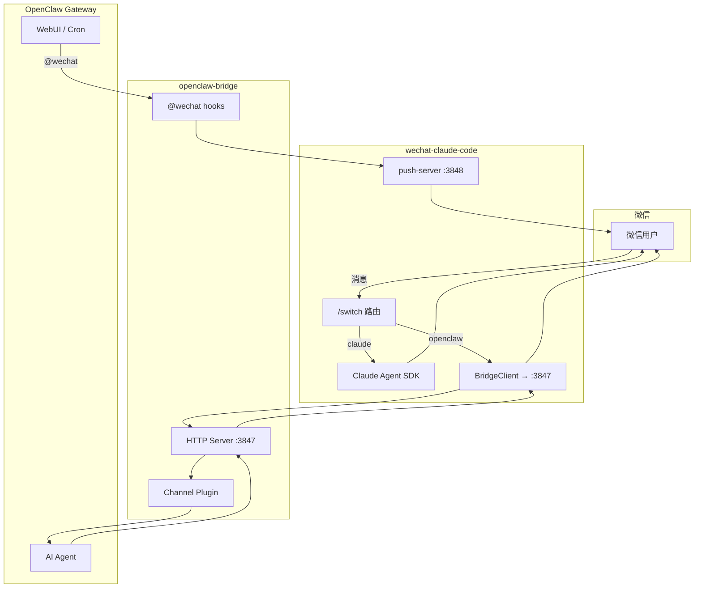

# claude-openclaw-wechat

> 基于 [wechat-claude-code](https://github.com/Wechat-ggGitHub/wechat-claude-code) 开发，感谢原作者的贡献。

用一个微信账号同时使用 **Claude Code** 和 **OpenClaw** 两个 AI 系统，并支持从任意渠道将 AI 回复推送到微信。

## 解决了什么问题

### 1. 微信双系统冲突

`wechat-claude-code`（对接 Claude Code）和 `openclaw-weixin`（对接 OpenClaw）各自独立监听同一个微信账号，两者互斥无法同时运行。

**方案：** 以 wechat-claude-code 作为微信消息的**唯一监听入口**，通过 `/switch` 在两个系统间动态切换。之所以基于 wechat-claude-code 修改扩展而不是基于 openclaw-weixin，是因为笔者日常使用 Claude Code 远多于 OpenClaw — 大部分消息直达处理，少数需要 OpenClaw 时再转发，避免反向架构的额外延迟。

### 2. 跨渠道回复无法触达微信

WebUI、定时任务（Cron）等渠道的 AI 回复停留在原始渠道，无法同步到微信。

**方案：** 在 openclaw-bridge 插件中检测 `@wechat` 标注，AI 回复自动推送到微信。

## 整体架构



**消息流向：**
- 微信消息 → wcc → `/switch` 路由 → Claude Code（默认）或 OpenClaw（转发到 bridge :3847）
- 非 微信渠道 `@wechat` → bridge hook → wcc push-server :3848 → 微信

**端口：** 所有端口仅监听 `127.0.0.1`，不暴露外网。

| 端口 | 进程 | 说明 |
|------|------|------|
| 3847 | OpenClaw gateway（bridge 插件） | 接收 wcc 转发的消息 |
| 3848 | wcc daemon（push-server） | 接收 bridge 推送的回复 |

## 模块

| 模块 | 说明 | 详情 |
|------|------|------|
| **wechat-claude-code** | 微信消息唯一入口，路由 + Claude Code 对话 + push-server | [→ README](wechat-claude-code/README.md) |
| **openclaw-bridge** | OpenClaw 插件，HTTP bridge channel + @wechat hooks | [→ README](openclaw-bridge/README.md) |
| openclaw-weixin | 仅开发参考，实际未使用 | — |

## 快速开始

### 前置条件

- Node.js >= 18
- macOS 或 Linux
- 个人微信账号（需扫码绑定）
- [Claude Code](https://docs.anthropic.com/en/docs/claude-code)（含 `@anthropic-ai/claude-agent-sdk`）
- OpenClaw CLI（如需 OpenClaw 路由）

### 安装

```bash
make install    # 构建 + 安装 bridge 插件 + 链接 wcc 到 ~/.claude/skills/
```

`make install` 会自动完成以下步骤：

| 组件 | 安装方式 | 目标位置 |
|------|---------|---------|
| wechat-claude-code | 构建后完整复制 | `~/.claude/skills/wechat-claude-code/` |
| openclaw-bridge | `openclaw plugins install` | `~/.openclaw/extensions/openclaw-bridge/` |

### 首次设置

```bash
cd ~/.claude/skills/wechat-claude-code && npm run setup   # 扫码绑定微信
```

### 启动

两个组件的启动方式不同：

| 组件 | 启动方式 | 说明 |
|------|---------|------|
| wechat-claude-code | 手动启动独立进程 | `npm run daemon -- start` |
| openclaw-bridge | OpenClaw gateway 自动拉起 | 无需手动启动，随 gateway 启动自动加载 |

```bash
cd ~/.claude/skills/wechat-claude-code && npm run daemon -- start   # 启动 wcc
openclaw gateway start                                              # 启动 gateway（bridge 随之自动启动）
```

### 常用命令

| 命令 | 说明 |
|------|------|
| `make build` | 构建两个项目 |
| `make install` | 构建 + 安装 bridge 插件 + 复制 wcc skill |
| `make restart` | 重启 gateway + wcc |
| `make restart-gateway` | 仅重启 OpenClaw gateway |
| `make restart-wcc` | 仅重启 wcc daemon |
| `make verify` | 验证安装状态 |
| `make clean` | 清理构建产物 |

### wcc daemon 管理

wcc 安装在 `~/.claude/skills/wechat-claude-code/`，使用系统原生服务管理（macOS launchd / Linux systemd），支持开机自启和自动重启：

```bash
cd ~/.claude/skills/wechat-claude-code
npm run daemon -- start     # 启动
npm run daemon -- stop      # 停止
npm run daemon -- restart   # 重启
npm run daemon -- status    # 状态
npm run daemon -- logs      # 查看日志
```

## 微信指令

### 路由切换（新增）

| 指令 | 说明 |
|------|------|
| `/switch` | 查看当前路由 |
| `/switch claude` | 切换到 Claude Code（默认） |
| `/switch openclaw` | 切换到 OpenClaw |
| `/whoami` | 当前路由 + 目标端可用性 |

### 会话管理

| 指令 | 说明 |
|------|------|
| `/help` | 显示帮助 |
| `/clear` | 清除当前会话 |
| `/reset` | 完全重置 |
| `/status` | 查看会话状态 |
| `/session` | 列出当前目录的 Claude 会话 |
| `/session new` | 新建会话（开始全新对话） |
| `/session select <n>` | 切换到第 n 个历史会话 |
| `/compact` | 压缩上下文（新 SDK 会话，保留历史） |
| `/history [数量]` | 查看对话记录 |
| `/undo [数量]` | 撤销最近对话 |

### 配置

| 指令 | 说明 |
|------|------|
| `/cwd [路径]` | 查看或切换工作目录（`-c` 自动创建） |
| `/model [名称]` | 切换 Claude 模型 |
| `/permission [模式]` | 切换权限模式 |
| `/prompt [内容]` | 设置系统提示词 |
| `/skills [full]` | 列出已安装 skill |
| `/version` | 查看版本 |

> `/session`, `/compact`, `/model`, `/permission`, `/prompt` 仅 Claude 模式下可用。openclaw 模式下输入这些命令会被拦截并提示切换。

### @wechat 跨渠道推送（新增）

### 支持的消息类型

| 类型 | 说明 |
|------|------|
| 文字 | 直接对话 |
| 图片 | Claude 自动分析图片内容 |
| 语音 | 提取微信服务器转写的文字处理（无需下载音频） |

## 多会话管理

同一工作目录下的 Claude 会话会被自动管理和复用：

- `/cwd <路径>` 切换目录时，自动恢复该目录最近使用的会话
- `/session` 列出当前目录的所有历史会话
- `/session new` 创建全新会话
- `/session select <n>` 切换到指定历史会话

底层直接扫描 `~/.claude/projects/{dir-hash}/` 的 session 文件，无需自建索引。

在 WebUI、Cron 等非微信渠道发送消息时添加 `@wechat`，AI 回复自动推送到微信：

```
帮我总结今天的日程 @wechat
```

- 仅非微信渠道 + 含 `@wechat` 才推送
- 微信来源消息不重复推送
- 推送失败只记日志，不影响原始通道

## 设计文档

- [架构设计文档](docs/architecture.md) — Mermaid 架构图 + 通讯流程图
- [SPEC.md](SPEC.md) — 统一规格文档

## 环境变量

| 变量 | 必需 | 说明 |
|------|------|------|
| `ANTHROPIC_API_KEY` | 是 | Claude API 密钥 |
| `ANTHROPIC_BASE_URL` | 否 | 自定义 API 端点（支持 OpenRouter、AWS Bedrock、智谱 GLM 等） |
| `ANTHROPIC_AUTH_TOKEN` | 否 | 认证 token（部分第三方服务需要） |

### 国内模型用户注意

如果你使用国内模型（智谱 GLM、DeepSeek 等），Agent SDK 可能读不到 `~/.claude/settings.json` 中的配置，导致认证失败（微信收到 `⚠️ Claude 处理请求时出错`，日志出现 401）。

**解决方法：** 用环境变量显式导出，不依赖 settings.json：

```bash
# 在启动 daemon 前导出
export ANTHROPIC_AUTH_TOKEN="your_api_key"
export ANTHROPIC_BASE_URL="https://open.bigmodel.cn/api/anthropic"

# 然后启动
cd ~/.claude/skills/wechat-claude-code && npm run daemon -- start
```

要持久化，加到 `~/.zshrc` 或 `~/.bashrc` 中。使用原生 Claude API（直连 Anthropic）的用户不受影响。

> 详细说明参考：[微信接管 Claude Code（续）：3 个命令，用 Agent SDK 直连满血 Claude](https://mp.weixin.qq.com/s/_BZIb8AhS6QjZBBMUG7m3A)

## 已知局限性

### 安全

- **HTTP 端口无认证**：3847/3848 已限制仅 localhost 访问（校验 remoteAddress），但未使用 token/API key 认证。同机其他进程理论上可调用。当前面向单用户开发场景，后续可按需增加。
- **联系人明文存储**：`~/.wechat-claude-code/contact.json` 以明文保存 userId 和 contextToken。需确保 `DATA_DIR` 目录权限正确。

### 隐私

- **日志不含消息内容**：已移除消息文本和回复内容的日志记录。
- **userId 记入日志**：微信 userId 仍出现在日志中（用于调试），生产环境应考虑脱敏。

### 架构

- **单用户模式**：当前设计假设单用户。多用户同时使用时，@wechat 推送可能发给错误的人。
- **推送无重试**：push-server 不可用时推送直接丢弃，无重试队列。

## 技术栈

| 组件 | 语言 | 运行时 | 关键依赖 |
|------|------|--------|---------|
| wechat-claude-code | TypeScript | Node.js >= 18 | Claude Agent SDK |
| openclaw-bridge | TypeScript | OpenClaw gateway | openclaw/plugin-sdk |

## License

[MIT](LICENSE)
