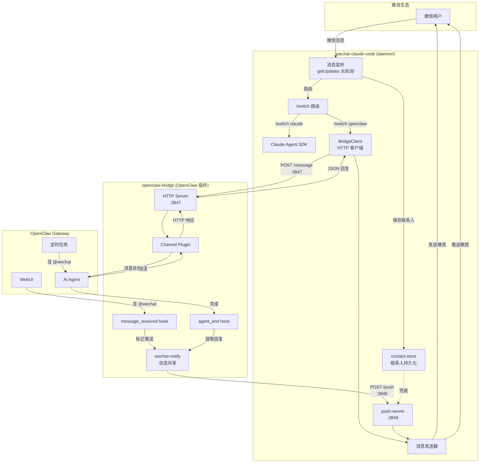
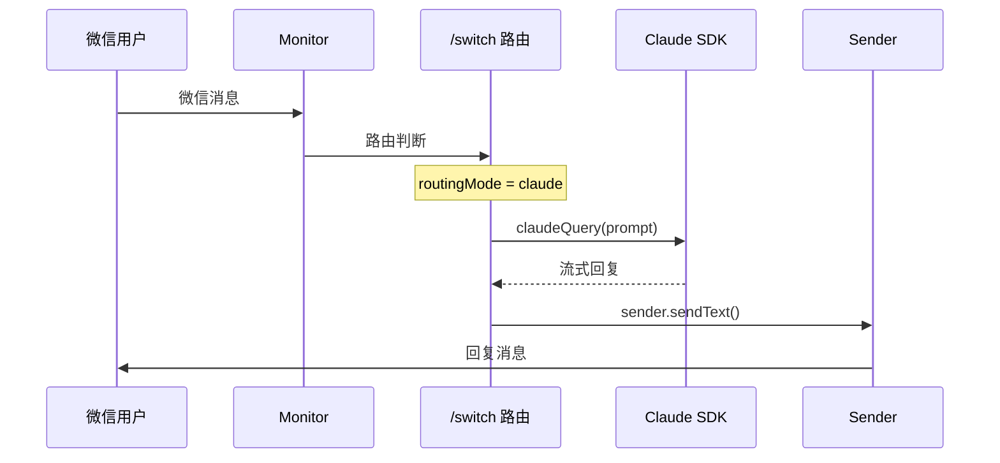
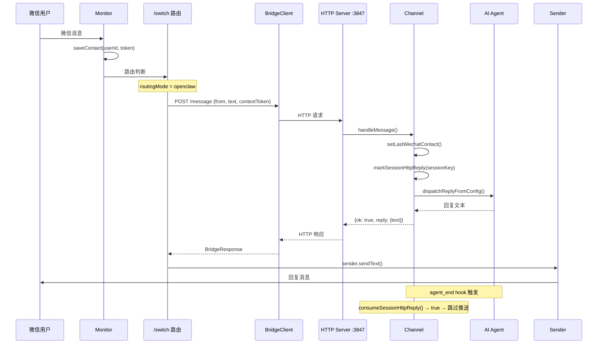
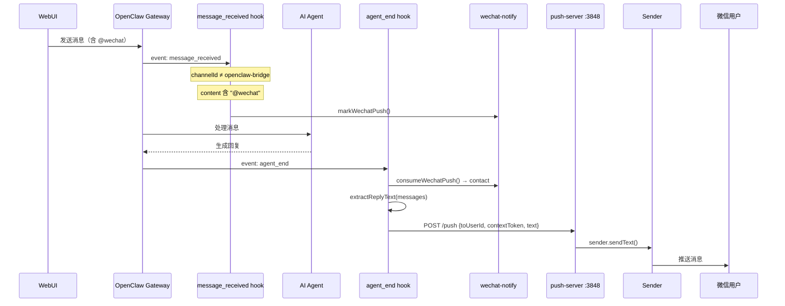
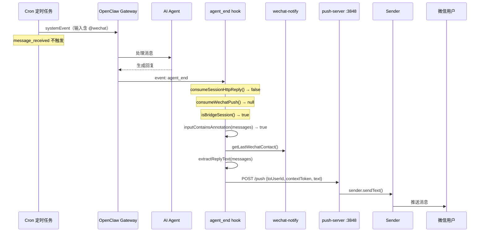
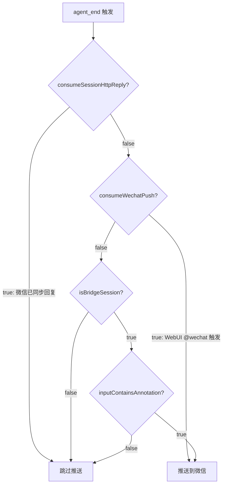
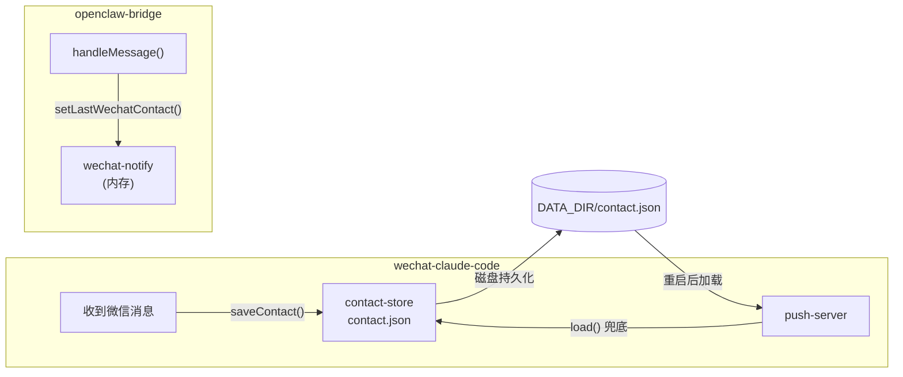

# 架构设计文档

## 系统架构图



## 消息流程

### 流程 1：微信消息 → Claude Code



### 流程 2：微信消息 → OpenClaw（同步回复）



### 流程 3：WebUI @wechat → 微信推送



### 流程 4：Cron @wechat → 微信推送



## 推送去重机制



## 联系人管理



**联系人解析优先级（push-server）：**
1. 请求中的 `toUserId` 参数
2. 持久化的 `contact.json`

**contextToken 解析优先级：**
1. 请求中的 `contextToken` 参数
2. `handler.getLastContextToken()`（wcc 最近收到的 token）
3. 持久化的 `contact.json` 中的 token

## 组件职责

| 组件 | 职责 |
|------|------|
| wechat-claude-code | 唯一微信消息监听入口，路由消息到 Claude Code 或 OpenClaw |
| openclaw-bridge | OpenClaw 插件，提供 HTTP bridge channel + @wechat hooks |
| wechat-notify | 内存共享状态：联系人、推送标记、HTTP 回复标记 |
| contact-store | 磁盘持久化：联系人信息（originalId + contextToken） |
| push-server | HTTP 端点，接收 bridge 转发的回复并发送到微信 |
| bridge-client | HTTP 客户端，转发微信消息到 bridge |

## 设计决策

### 单用户模式

当前为单用户模式，wechat-notify 使用模块级变量存储唯一联系人。无需复杂的会话匹配，只需跟踪最近一个微信联系人。

### 同步回复 vs 异步推送

- **微信消息**：通过 bridge HTTP 同步请求-响应模式获取回复，经 wcc 发回微信
- **跨渠道推送**：通过 agent_end hook 异步捕获回复，经 push-server 推送到微信

### Cron @wechat 检测

Cron systemEvent 不触发 `message_received` hook，因此在 `agent_end` 中检测输入消息是否包含 `@wechat`：
- `isBridgeSession(sessionKey)` 判断是否来自 bridge
- `inputContainsAnnotation(messages)` 检查输入中的 user/system 消息是否包含 `@wechat`

## 异常与失败场景

### Bridge 不可用

```
用户发送 /switch openclaw
  → bridgeHealthCheck() → 失败
  → 拒绝切换，提示排查

用户在 openclaw 模式发消息
  → BridgeClient.send() → 连接失败
  → 回复 "⚠️ OpenClaw 请求失败，请确认 bridge 和 gateway 已启动"
```

**影响范围：** 仅 openclaw 模式受影响，claude 模式正常。

### Push-server 不可用

```
WebUI 发送含 @wechat 的消息
  → agent_end hook → POST :3848/push
  → 连接被拒 / 超时
  → console.error 记录失败日志

Cron 触发含 @wechat 的任务
  → 同上
```

**影响范围：** 推送丢弃，不影响原始通道（WebUI/Cron 正常收到回复）。无重试机制。

### OpenClaw 处理超时

```
微信消息 → BridgeClient → POST :3847 → bridge → OpenClaw
  → OpenClaw 挂起，120s 后 BridgeClient abort
  → 回复 "⚠️ OpenClaw 处理失败"
```

**影响范围：** 用户等待 120s 后收到超时错误。

### Contact 丢失

```
wcc 重启后，内存中无联系人
  → loadContact() 从 contact.json 恢复
  → 若 contact.json 不存在（首次运行 / 文件损坏）
  → @wechat 推送时 POST /push 返回 "no wechat contact available"
```

**影响范围：** 用户需先通过微信发一条消息建立联系人。

### 多用户竞态

```
用户 A 发消息 → setLastWechatContact(A)
用户 B 发消息 → setLastWechatContact(B)  （覆盖 A）
WebUI @wechat → 推送给 B（最新的联系人）
  → A 收不到推送
```

**影响范围：** 当前为单用户设计，多用户场景需改为 userId → contact 映射。

## 安全措施

| 措施 | 说明 |
|------|------|
| localhost 限制 | 3847/3848 校验 remoteAddress，拒绝非本地连接 |
| 请求体大小限制 | 最大 1 MB，防止内存耗尽 |
| 无 CORS 头 | 不暴露跨域访问 |
| 日志脱敏 | 不记录消息内容，仅记录长度 |
